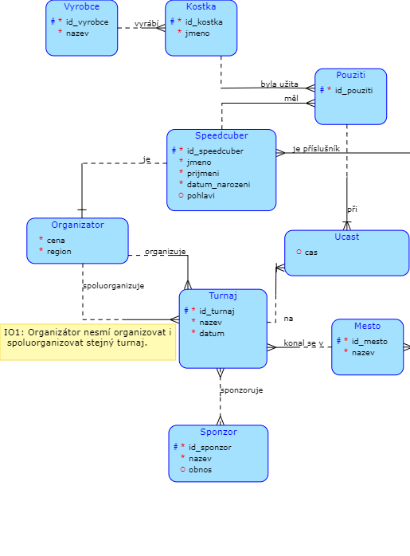

# WCA 
### Database project simulating WCA speedcubing database.

## Conceptual schema

## Overview
My first database project made in *PostgreSQL*. 
Database consists of **10 tables, 500+ records, 10 RA queries and 25 SQL queries.**

## Summary
Scored **65/60** points for this projects. Overall enjoyed making this project and very happy with the outcome. :relaxed: